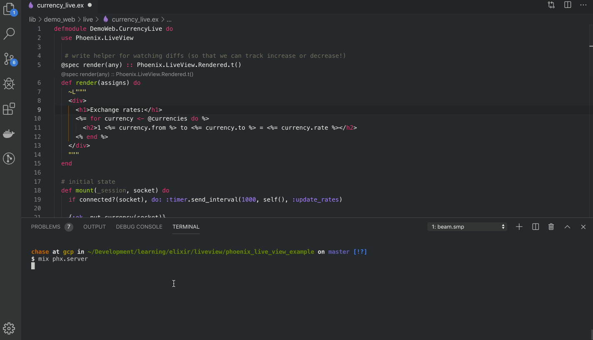

# ExCurrencyLiveView

An Phoenix LiveView application that streams currency exchange rates from [www.investing.com](https://www.investing.com)

To start your Phoenix server:

  * Install dependencies with `mix deps.get`
  * Install Node.js dependencies with `cd assets && npm install`
  * Start Phoenix endpoint with `mix phx.server`

Now you can visit [`localhost:4000`](http://localhost:4000) from your browser.

To get a list of currency conversions, use the following query format:

```
http://localhost:4000/?from=usd&to=rub,jpy,dkk,nzd
```

Note: You might see some 406 errors. Apparently people don't like their sites getting scrapped.

